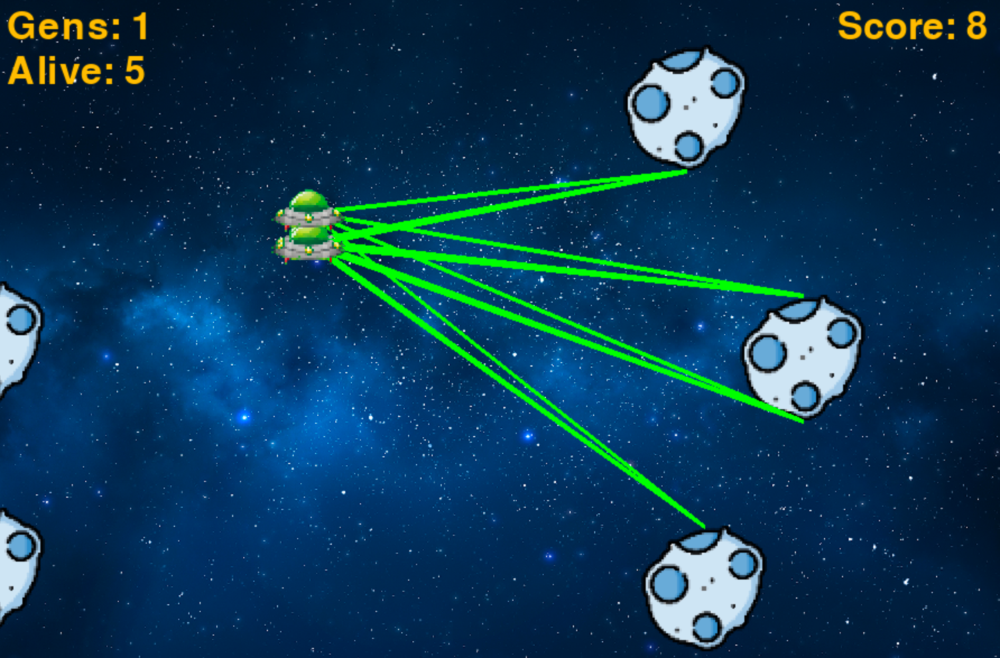

# NEAT_Simulation
An AI that controls a spaceship and dodges incoming asteroids using a genetic algorithm that creates a neural network.

## Required Python Modules:
Pygame, NEAT

## Simulation:

## Simulation Mechanics:
     - Asteroids are spawned on to screen at random positions
  
     - Asteroids hurtle towards spaceship at random speed
  
     - Depending on which asteroids the spaceship is in between, the NEAT neural network calculates when to jump
     
     - Spaceship attempts to stay in between 2 closest asteroids so it can pass through
